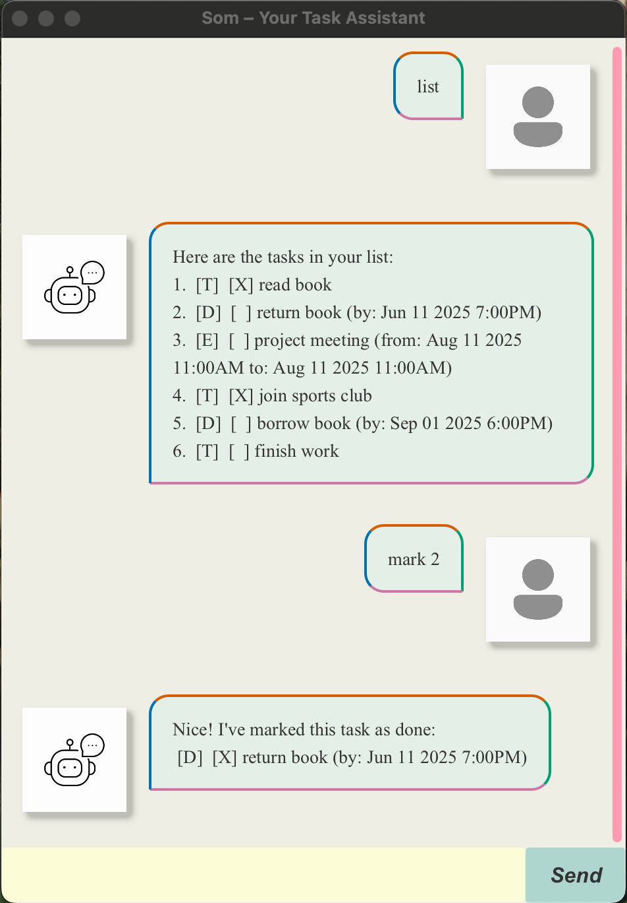

# Som – Your Smart Task Companion 🤖✅

> “Your mind is for having ideas, not holding them.” – David Allen  
> _[Getting Things Done](https://en.wikipedia.org/wiki/Getting_Tthings_Done)_

**Som** is a lightweight, CLI-based task manager that helps you organize your tasks without distractions. Built with clean OOP design and Gradle automation, it’s fast, reliable, and easy to use.

---

## ✅ Features

- [x] Add tasks: `todo`, `deadline`, `event`
- [x] Mark/unmark tasks as done
- [x] Delete tasks
- [x] List all tasks
- [x] Find tasks by keyword
- [x] Save tasks automatically to disk
- [x] Support for tagging: `#work`, `#personal`
- [x] Sort deadlines/events chronologically
- [x] JavaFX GUI (Level 10)

---

## 🚀 Quick Start

### Prerequisites
- Java 17 or higher
- Mac users: Ensure you have the precise JDK version prescribed [here](https://se-education.org/guides/tutorials/javaInstallationMac.html).
- Git (optional, for cloning)

### How to Run

#### Run from JAR (Recommended)
1. Download the latest .jar file from [here](https://github.com/reven0n/ip/releases)
2. Copy the file to the folder you want to use as the home folder for your ChatBot.
3. Open a command terminal, `cd` into the folder you put the jar file in, and use the `java -jar som.jar` command to run the application.

#### How to Use
Type the command in the command box and press Enter to execute it. e.g. typing help and pressing Enter will show the help menu.
Some example commands you can try:
- `todo read book`: Adds a simple task with no deadline
- `mark 1`: Marks task #1 as completed
- `delete 3`: Deletes task #3 from the list
- `find book`: Finds all tasks containing "book"
- `sort`: Sorts deadlines and events by date
- `list`: Displays all tasks in the current list

---

| Command    | Description | Example Usage                                             |
|------------|------------|-----------------------------------------------------------|
| `list`     | Show all current tasks | `list`                                                    |
| `todo`     | Add a todo task | `todo read book`                                          |
| `deadline` | Add a deadline task | `deadline return book /by 2025-09-20 1300`                |
| `event`    | Add an event task | `event meeting /from 2025-09-20 1300 /to 2025-09-20 2100` |
| `mark`     | Mark a task as completed | `mark 2`                                                  |
| `unmark`   | Unmark a completed task | `unmark 2`                                                |
| `delete`   | Delete a task | `delete 3`                                                |
| `find`     | Find tasks matching a keyword | `find report`                                             |
| `help`     | Show help message | `help`                                                    |
| `sort`     | Sorts deadlines and events by date | `sort`                                                    |
| `bye`      | Exit the program | `bye`                                                     |
