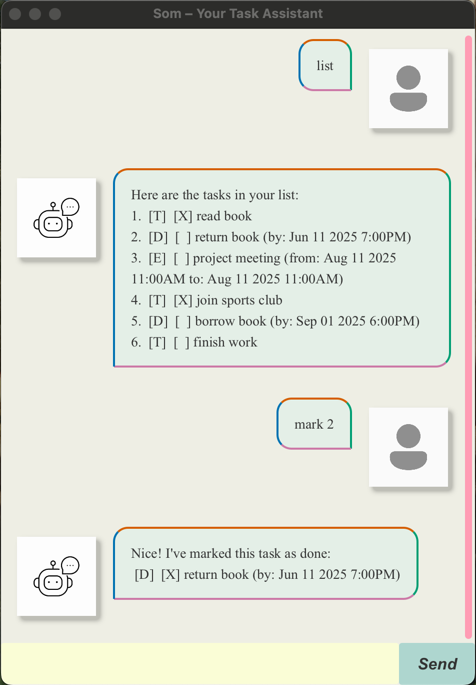

# Som – Your Smart Task Companion 🤖✅

> “Your mind is for having ideas, not holding them.” – David Allen  
> _[Getting Things Done](https://en.wikipedia.org/wiki/Getting_Tthings_Done)_

**Som** is a lightweight, CLI-based task manager that helps you organize your tasks without distractions. Built with clean OOP design and Gradle automation, it’s fast, reliable, and easy to use.



---

## ✅ Features

- [x] Add tasks: `todo`, `deadline`, `event`
- [x] Mark/unmark tasks as done
- [x] Delete tasks
- [x] List all tasks
- [x] Find tasks by keyword
- [x] Save tasks automatically to disk
- [x] Support for tagging: `#work`, `#personal`
- [x] Sort deadlines/events chronologically
- [x] JavaFX GUI (Level 10)

---

## 🚀 Quick Start

### Prerequisites
- Java 17 or higher
- Mac users: Ensure you have the precise JDK version prescribed [here](https://se-education.org/guides/tutorials/javaInstallationMac.html).
- Git (optional, for cloning)

### How to Run

#### Run from JAR (Recommended)
1. Download the latest .jar file from [here](https://github.com/reven0n/ip/releases)
2. Copy the file to the folder you want to use as the home folder for your ChatBot.
3. Open a command terminal, `cd` into the folder you put the jar file in, and use the `java -jar som.jar` command to run the application.

#### How to Use
Type the command in the command box and press Enter to execute it. e.g. typing help and pressing Enter will show the help menu.
Some example commands you can try:
- `todo read book`: Adds a simple task with no deadline
- `mark 1`: Marks task #1 as completed
- `delete 3`: Deletes task #3 from the list
- `find book`: Finds all tasks containing "book"
- `sort`: Sorts deadlines and events by date
- `list`: Displays all tasks in the current list

---

## Features
### Viewing Help: `help`
Shows a list of all available commands and their usage.<br>
- Format: `help`
#### Example Output
``` 
Available commands:
  todo <desc>                  – Add a todo
  deadline <desc> /by <time>   – Add a deadline
  event <desc> /from <start>   – Add an event /to <end>
  list                         – Show all tasks
  mark <index>                 – Mark task as done
  unmark <index>               – Mark task as not done
  delete <index>               – Delete a task
  find <keyword>               – Find tasks by keyword
  sort                         – Sort deadlines/events by date
  bye                          – Exit the app 
```
### Adding a Task: `todo`, `deadline`, `event`
Adds a new task to your list. <br>
#### `todo`: Simple Tasks with No Deadline
- Format: `todo <description>`<br>
- Example: `todo read book`
#### `deadline`: Tasks with Due Date/Time
- Format: `deadline <description> /by <YYYY-MM-DD> <HHmm>`<br>
- Example: `deadline submit report /by 2025-03-15 2359`
#### `event`: Events with Start and End Time
- Format: `event <description> /from <YYYY-MM-DD HHmm> /to <YYYY-MM-DD HHmm>`<br>
- Example: `event team sync /from 2025-03-16 0900 /to 2025-03-16 1000`
### Listing All Tasks: `list`
Displays all tasks currently in your list with their index and status.<br>
- Format: `list`
#### Example Output:
``` 
Here are the tasks in your list:
 1.[T][ ] read book
 2.[D][X] submit report (by: Mar 15 2025 11:59 PM)
 3.[E][ ] team sync (at: Mar 16 2025 9:00 AM to 10:00 AM)
```
### Marking a Task as Done: `mark`
Marks a task as completed.
- Format: `mark <index>`
- Example: `mark 1`
#### Example Output
```
 Nice! I've marked this task as done:
 [T][X] read book
```
### Marking a Task as Not Done: `unmark`
Marks a task as not complete.
- Format: `unmark <index>`
- Example: `unmark 1`
#### Example Output
```
 OK, I've marked this task as not done yet:
 [T][X] read book
```
### Deleting a Task: `delete`
Removes a task from the list.
- Format: `delete <index>`
- Example: `delete 2`
#### Example Output
```
Noted. I've removed this task:
  [D][X] submit report (by: Mar 15 2025 11:59 PM)
 Now you have 2 tasks in the list
```
### Finding Tasks: `find`
Searches for tasks whose description contains the given keyword(s).
- Format: `find <keyword>`
- Example: `find book`
#### Example Output
```
Here are the matching tasks in your list:
  1.[T][ ] read book
```
### Sorting Tasks: `sort`
Sorts deadlines and events chronologically by date/time. Todos appear at the end.
- Format: `sort`
#### Example Output After Sorting
```
1.[E][ ] team sync (at: Mar 16 2025 9:00 AM to 10:00 AM)
2.[D][X] submit report (by: Mar 15 2025 11:59 PM)
3.[T][ ] read book
```
### Exiting the Application: `bye`
Exits the Application
- Format: `bye`
---
### Saving the data
Som automatically saves all your tasks in a file named som.txt in the data directory 
after every command that modifies the task list. The data file is automatically 
created if it does not exist. Do not try to edit the file as the data might get 
corrupted.
